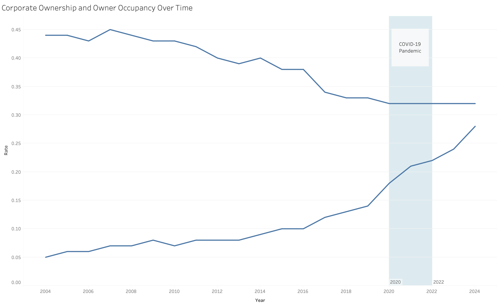

# Investigating Corporate Ownership Rates in Boston

The three overall questions I will be investigating are as follows:

1. **What is the distribution of owner occupied vs. corporate owned homes across the Boston Area?** TODO motivation
1. **How has corporate ownership changed over time in the Boston Area?** TODO motivation
1. **How has corporate ownership influenced housing availability in student communities?** TODO motivation

## Data Overview

## Question 1: Spatial Distribution of Owner Occupied vs. Corporate Owned Homes

### Followup: Demographics of High Owner-Occupancy Neighborhoods

## Question 2: Change in Corporate Ownership Over Time

### Followup: Was change in ownership accelerated by the pandemic?

## Question 3: Influence of Corporate Owneship on Student Communities

### Followup: What about influence on vacancy?

## Conclusions
